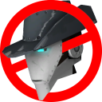
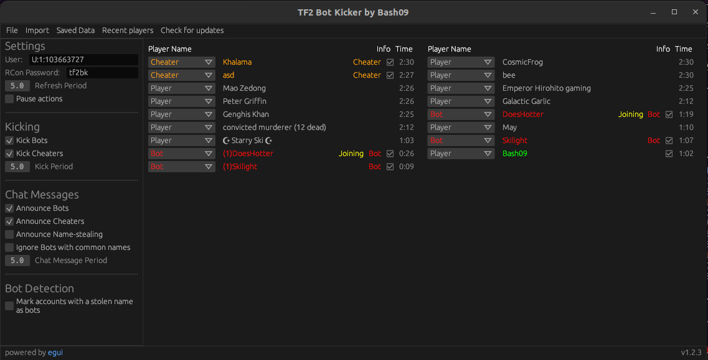
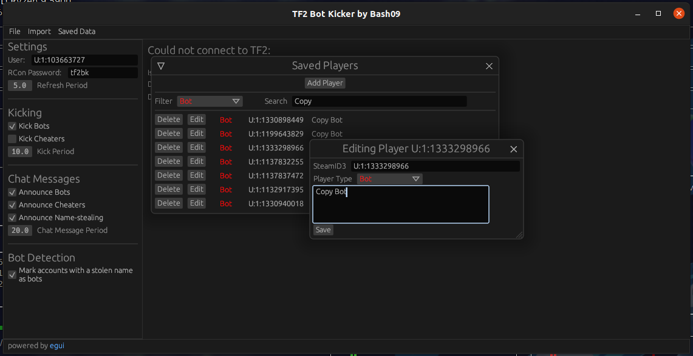

<p align="center">
  
</p>

# TF2 Bot Kicker by Bash

A (somewhat) cross-platform bot identifier/kicker written in Rust.



# Preface

This project is no longer maintained. It still functions as intended and is a great alternative to TF2BD, however a lot of the later features were never published in a release so I recommend building the application yourself for the best experience.

I'm currently working on the [MAC Client](https://github.com/MegaAntiCheat/client-backend) instead which will eventually offer most of the functionality of this project (though not all) with some additional benefits.

# What it does

This is a program you run alongside TF2 while you play which automatically attempts to identify and vote-kick bots and cheaters on the server you are playing on, and can also send chat messages in-game to alert other players of bots or cheaters joining the server. It does this by maintaining a list of know or previously-seen steamids and checking if the players on the server are on that list, and if that fails it also checks player names against a list of regex rules to identify common bots such as DoesHotter or m4gic. It also features name-stealing detection, however that may not be necessary anymore as Valve has (hopefully) fixed name-stealing for good.

This program operates using features already included in the Source engine as intended, no cheats required (so no VAC bans!).

# Usage

Download the program from [here](https://github.com/Googe14/tf2-bot-kicker-gui/releases).


1. Add the following 3 lines to your TF2 autoexec.cfg (You can choose anything for the rcon_password, you will just have to set it when you start the program)

```
ip 0.0.0.0
rcon_password tf2bk
net_start
```
2. Add `-condebug -conclearlog -usercon` to your TF2 launch options. (Right click Team Fortress 2 in your Steam library, select Properties, and paste into the Launch Options section)
3. Launch TF2.
4. Run the program and set your TF2 directory.

Next time you play TF2 you will just need to start the program and it will do everything else for you!

# Building

Install Rust: https://www.rust-lang.org/tools/install

May need to enable rust nightly: `rustup default nightly`

On Linux some packages will need to be installed (commands are provided for Ubuntu, other distros will have to figure out how to install the equivalent packages):
```
wget http://archive.ubuntu.com/ubuntu/pool/main/o/openssl/libssl1.1_1.1.0g-2ubuntu4_amd64.deb
sudo dpkg -i libssl1.1_1.1.0g-2ubuntu4_amd64.deb
sudo apt-get install libxcb-render0-dev libxcb-shape0-dev libxcb-xfixes0-dev libgtk-3-dev libglib2.0-dev
```

The program can then be built and run with `cargo run --release`

# Settings and Configuration

To reset your settings, delete the `settings.json` file in the `cfg` folder.

### General
* `User` - Your SteamID3 (like from when you use the status command in-game) to indentify if bots are on the friendly or enemy team. (will stop attempting to kick enemy bots if set)
* `RCon Password` - Make sure this is the same as is set by rcon_password in your autoexec.cfg file.
* `Refresh Period` - How often to refresh the info from the server
### Kicking
* `Kick Bots` - Automatically call votekicks on identified bots.
* `Kick Cheaters` - Automatically call votekicks on known cheaters.
* `Kick Period` - How many seconds between kick attempts
### Chat Messages
* `Announce Bots` - Send chat messages indicating bots joining the server.
* `Announce Cheaters` - Send chat messages indicating cheaters joining the server (If both bot and cheater announcements are enabled they will be combined into singular chat messages).
* `Announce Name-stealing` - Announce when a bot changes it's name to another player's name (will check for invisible characters in their name as well). Hopefully this is no longer needed with Valve's recent patches.
* `Ignore Bots with common names` - Don't bother to announce bots who's name matches a regex. Can be used to still announce bots with unpredictable names without spamming the chat that another m4gic is joining the game.
* `Chat Message Period` - Time in seconds between sending chat messages.
### Bot Detection
* `Mark accounts with a stolen name as bots` - Enable accounts that steal another player's name to be automatically marked as a bot.

### Other
Any saved regexes or players can be accessed/added/editted/deleted from the `Saved Data` tab at the top.



## Account identification

A list of accounts is stored in `cfg/playerlist.json` containing the SteamID, player type (Player/Bot/Cheater) and any recorded notes for that account. When players join the server their steamid is matched against this list to determine if they are a bot or cheater and will take appropriate action (send chat messages, kick, etc). If they are not a know account their name will be checked against a list of regexes in case they have a common bot name (e.g. DoesHotter).

# How it works
 
The Source engine allows programs to initiate a `remote console` or `RCON` to the game (provided you have the correct launch options set) through TCP, which means this program can connect to TF2 and send in-game commands to the console remotely. By using commands such as `tf_lobby_debug` and `status` we can retrieve information about players on the server you are currently connected to (such as their name, steamid, which team they are on, how long they have been connected to the server, etc) which is used to check the existing steamid list and name rules to identify players as bots or cheaters. Once that is known, we can call a votekick or send chat messages through more remote console commands.

Some commands do not respond through rcon but instead output their contents into the in-game console. Instead, by using the `-condebug -conclearlog` launch options TF2 will output the in-game console to a log file in real-time which this program reads from, this is why you are required to set your TF2 directory on program startup.
