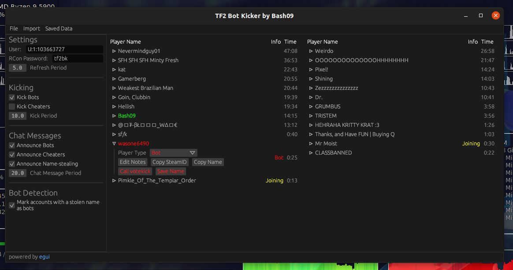

# tf2-bot-kicker-gui

A (somewhat) cross-platform bot identifier/kicker written in Rust.



# Usage

Download the program from [here.](https://github.com/Googe14/tf2-bot-kicker-gui/releases)

```
ip 0.0.0.0
rcon_password tf2bk
net_start
```

1. Add the above 3 lines to your TF2 autoexec.cfg (You can choose anything for the rcon_password, you will just have to set it when you start the program)
2. Add `-condebug -conclearlog -usercon` to your Steam TF2 launch options. (Right click Team Fortress 2 in your Steam library, select Properties, and paste into the Launch Options section)
3. Launch TF2.
4. Run the program and set your TF2 directory.

# Settings and Configuration

To reset your settings, delete the `settings.json` file in the `cfg` folder.

`User` - Your SteamID3 (like from when you use the status command in-game) to indentify if bots are on the friendly or enemy team. (will stop attempting to kick enemy bots if set)\
`RCon Password` - Make sure this is the same as is set by rcon_password in your autoexec.cfg file.\
`Kick Bots` - Automatically call votekicks on identified bots.\
`Join Alerts` - Send chat messages that say when a bot is joining the server.\
`Chat Reminders` - Send regular messages in chat to alert other players of current connected bots.\
`Period` - Time in seconds between actions (each alert/chat reminder message, kick attempt and server refresh)\
`Automatically record bot SteamIDs` - Record the SteamID of bots identified by name to a list.

`Active SteamID/Regex list` - Setting a SteamID or Regex list as active will cause automatically or manually recorded SteamIDs or Regexes to be appended to that list. You can see the active list by it's green name.

Note: I encourage you to not leave Chat Reminders on if the period is reasonably low (maybe 30 seconds?) as that may be annoying for the other players, find a balance or turn reminders off. I personally play with no Chat Reminders or Join Alerts at a period of 10 seconds.


## Bot identification

Bots are identified either by their name or steamid according to lists that you can add and remove from the program in the settings panel and File menu.

Regex files should be a plain text file with a regex pattern on each line. SteamID files should be a plain text file which contain any number of SteamID3s, they do not need to be on new lines.

# Building
This program should build without issue through Cargo on Windows. 

On Linux some libraries may need to be installed. (As listed in the Ubuntu repository)

`librust-gdk-dev`\
`libudev-dev`\
`libxcb-render0-dev`\
`libxcb-shape0-dev`\
`libxcb-xfixes0-dev`

# How it works
 
By adding `-usercon` to your TF2 launch options and the settings in your `autoexec.cfg` file, programs are able to initiate a Remote CONsole with the game over a TCP connection. From this RCON connection, this program can execute commands and read the response while you are busy playing TF2. Using commands like `status` and `tf_lobby_debug`, the program is able to see the names and SteamIDs of players in your Casual server, which it uses to identify bots according to the SteamIDs or names saved in any files you have set in the program. If any players are identified as a bot by their SteamID or name, this program will take appropriate action.

Unfortunately the `status` command runs but does not respond over rcon, instead outputting into the local game console. To overcome this, `-condebug -conclearlog` is added the the TF2 launch options to output the contents of the in-game console to a log file, which this program reads from to get the output of the status command.