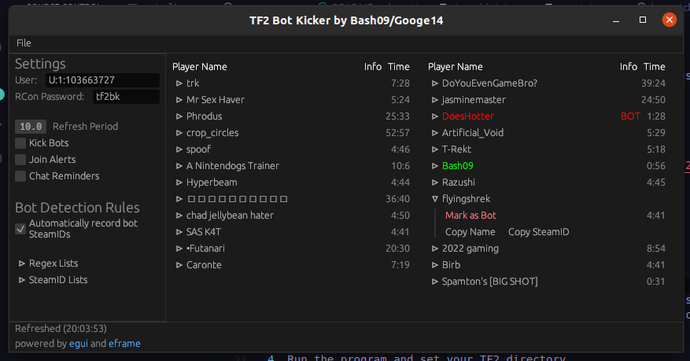

# tf2-bot-kicker-gui

A (somewhat) cross-platform bot identifier/kicker written in Rust.

# Usage

Download the program from [here.](https://github.com/Googe14/tf2-bot-kicker-gui/releases)

1. Add `bind F8 "exec command"` to your TF2 autoexec.cfg (or whichever key you set)
2. Add `-condebug -conclearlog` to your Steam TF2 launch options. (Right click Team Fortress 2 in your Steam library, select Properties, and paste into the Launch Options section)
3. Launch TF2.
4. Run the program and set your TF2 directory.

## Windows

Should work without issue.

## Linux

Linux users may have to install some of the following packages. (As listed in the Ubuntu repository)

`libinput-bin`

### Wayland

Some Wayland environments will not allow `libinput` access to `/dev/uinput` without root.

To fix this you can either run the program as root with sudo, or grant access to `/dev/uinput` with `chmod +0666 /dev/uinput` before running the program (This command will not persist after restart and will need to be run each time before using this program, for a more permanent solution you can follow the instructions under "Without X11" at https://crates.io/crates/tfc).

# Settings and Configuration

To reset your settings, delete the `settings.json` file in the `cfg` folder.

`User` - Your SteamID3 (like from when you use the status command in-game) to indentify if bots are on the friendly or enemy team. (will stop attempting to kick enemy bots if set)\
`Kick Bots` - if you want to automatically call votekicks on bots.\
`Join Alerts` - if you want to send chat messages that say when a bot is joining the server.\
`Chat Reminders` - if you want regular messages in chat to alert other players of current connected bots.\
`Period` - Time in seconds between actions (each alert/kick attempt)\
`Command Key` - Which key the program will use to run commands. If you change this, be sure to update the key bind in your `autoexec.cfg` file

Notes:
1. I encourage you to not leave Chat Reminders on if the period is reasonably low (maybe 30 seconds?) as that may be annoying for the other players, find a balance or turn reminders off. I personally play with no Chat Reminders or Join Alerts at a period of 10 seconds.
2. It is recommended to use a key that isn't used much by other programs such as F8, as to avoid it potentially being pressed when you have the game tabbed-out or similar. Although the program will automatically pause and start when you connect/disconnect from a server so this only applies if you are tabbed-out during a game (or switching server).

## Bot identification

Bots are identified either by their name or steamid according to lists that you can add and remove from the program in the settings panel and File menu.

Regex files should be a plain text file with a regex pattern on each line. SteamID files should be a plain text file which contain any number of SteamID3s, they do not need to be on new lines.

# Building
This program should build without issue through Cargo on Windows. 

On Linux some libraries may need to be installed. (As listed in the Ubuntu repository)

`librust-gdk-dev`\
`libudev-dev`\
`libxcb-render0-dev`\
`libxcb-shape0-dev`\
`libxcb-xfixes0-dev`

# How it works
 
By adding `-condebug -conclearlog` to your TF2 launch options, the game outputs the contents of the in-game console to a log file in real-time. By running certain commands, this log file can reveal players and their SteamIDs on casual servers, this program writes these commands to a cfg file in the TF2 directory and simulates a keypress to run those commands via the keybind. Players names and steamids are then checked against certain rules and if they are determined to be a bot, action can be taken. No hacks required!
